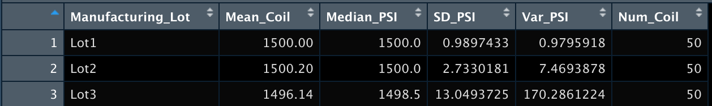

# R_Analysis
## Purpose 
The purpose of this analysis are as follows:
- Perform multiple linear regression analysis to identify which variables in the dataset predict the mpg of MechaCar prototypes.
- Collect summary statistics on the pounds per square inch (PSI) of the suspension coils from the manufacturing lots.
- Run t-tests to determine if the manufacturing lots are statistically different from the mean population.
- Design a statistical study to compare vehicle performance of the MechaCar vehicles against vehicles from other manufacturers. For each statistical analysis, then write a summary of the findings.

## Deliverable 1: Linear Regression to Predict MPG
Using the provided CSV file (MechaCar_mpg.csv), I designed a linear model that predicts the mpg of MechaCar prototypes using several variables (vehicle length, weight, AWD, mpg, spolier angle and ground clearance).

### Summary
- The variables that provide a non-random amount of variance of the mpg values are vehicle_lenth and gound_clearance. 
- Based on the data gathered, the slaope of the linear model cannot be zero. The p-value I received is 5.35e-11 which is significantlly smaller than the 0.05% significance level. Because of this, we can reject the null hypothesis.
- This linear model predicts mpg efficiently because the r-squared value is around 71% which indicates that 71% of the predictions can be determined by this model created.

#### Linear Regression 

## Deliverable 2: Create Visualizations for the Trip Analysis
Using the Suspension_Coil.csv file, I created a summary statistics table showing the suspension coil's PSI continuous variable across all manufacturing lots and got the mean, median, variance, and standard deviation of each lot.

### Summary Statistics on Suspension Coils
- Based on the variance, MechaCar specifications desire that the suspenion coils must not exceed 100 pounds per sqaure inch. According to the data, lots 1 and 2 are both well under the maximum weight. Lots 1 and 2 have a variance of 0.9795918 and 7.4693878 respectively. On the other hand, lot 3 is exceeding the 100lbs per square inch specifications with a varaince of 170.2861224. Individually, lot 3 is the odd one out simply due to is masive difference in varaince compared to the other two. Because of this, the lots all together exceed the desired specifications. 

#### Statistics on Suspension Coils

#### Statistics on Suspension Coils by Manufacturing Lot

## Deliverable 3: T-Tests on Suspension Coils 
For Deliverable 3, I performed t-tests to determine if all manufacturing lots and each lot individually are statistically different from the population mean of 1500 pounds per square inch. 

### Summary of t-tests
- Looking at the data gathered, all of the measuremnts of PSI across all lot are not completely different from the population mean of 1500 lbs per square inch. When performing the t-tests each lot was either on, or very near the population mean:
  - The t-test of Lot 1 has a mean of 1500 PSI. 
  - The t-test of Lot 2 has a mean of 1500.2 PSI.
  - The t-test of Lot 3 has a mean of 1496.14 PSI.

#### T-Test for Lot 1

#### T-Test for Lot 2

#### T-Test for Lot 3

## Deliverable 4: Design Study COmparing the MechaCar to the Competition 
For the last deliverable, I designed a statistical study to compare performance of the MachaCar vehicles against performance of vehicle from other maufacturers.

### Study Design: MechaCar vs Competition
- What metrics would I be using to test?
  - Depednent Variable: The dependent variable for this anaylsis would be the current selling price.
  - Independent Variable: For in order to compare, the independent variables should be features such as safety, MPG, Maintenence, the type of engine, even resale value.
- What is the null and alternative hypothesis?
  - Null hypothesis: The pricing of MechaCar is based on its performance of key factors.
  - Alternative hypothesis: The pricing of MechaCar is not based on its performance of key factors.
- What statistical test would I use to test the hypothesis? Why?
  - I think the best statistical test to use for this analysis is a multiple linear line regression in order to determine the factors that have correlation between the     factors themselves and the selling price. We can find out what factor has the greatest impact on price overall by comparing multiple factors.
- What data is needed to run the statistical test?
  - In order to carry out this test, we would need simialr data from the competition to compare and contrast the companies.

## Resources
- R
- RStudio
- tidyverse
